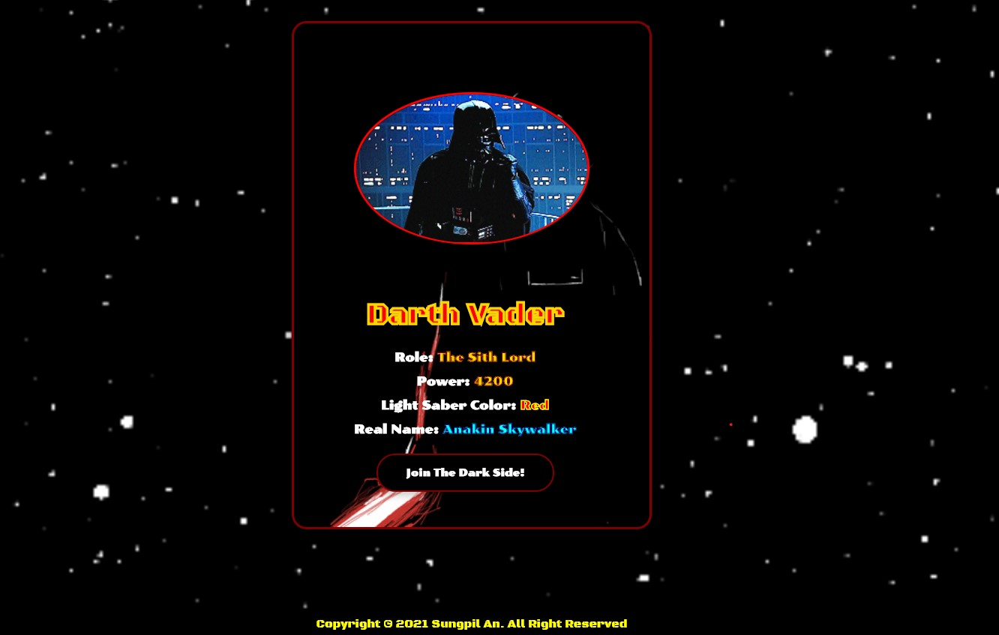
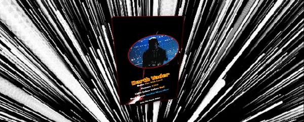
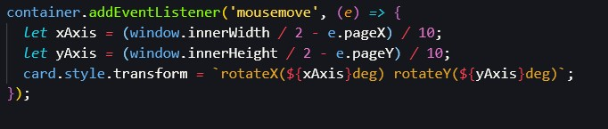
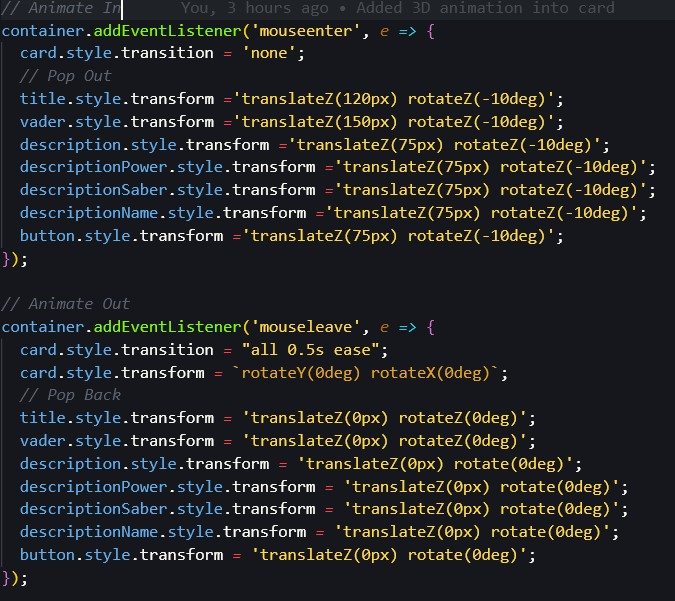

# **3D DARTH VADER CARD**

## **Greetings!**
### **_This is "3D Darth Vader Card" using HTML5, CSS, and Javascript with the use of "rotate" and "transform" function in Javascript._** 
---

## **Screenshot:**

---

## **Example Gif:**

---
## **"Click" the button if you dare to join the DARK SIDE!**

#### **This button allows the user to turn "ON" and "OFF" of the embedded music**

---
### **With the use of "Rotate" and "Transform" functions, I was able to make the card seems like 3D object.**

---

---

## **Installation**
### **_git clone this_**: **git@github.com:ahnlok/darth-vader-3D-card.git**

---
## **Inspiration**
### **_This project is inspired by Dev Ed's "Awesome 3D Animation Javascript Tutorial"_**
#### **_Video Link_**: **<"https://www.youtube.com/watch?v=XK7T3mY1V-w&list=PLh1RaM1IojKHSXyZX7de5zN71Aa499OOz&index=4&t=1039s">**

---
## **GitHub**
### **_GitHub_**: **<https://github.com/ahnlok/darth-vader-3D-card>**
### **_Deployed Github Site_**: **<https://ahnlok.github.io/darth-vader-3D-card/>**

---

## **Contact**
### **_E-Mail_**: **<ansungpil1@gmail.com>**
### **_LinkedIn_**: **<https://www.linkedin.com/in/an-sungpil-95ab8490/>**
### **_GitHub_**: **<https://github.com/ahnlok>**

---
## **License**
### **© Sungpil An 2021**

#### _Licensed under the MIT License_